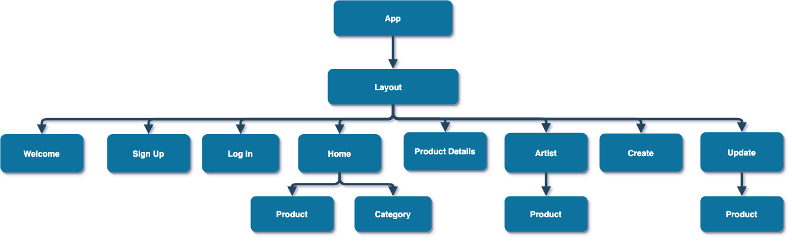

# Artlist
 React on Rails full stack utilizing a RESTful JSON API. 

# PROJECT 4 README <!-- omit in toc -->

> The Project Planning section **should be completed** for your project pitch with instructors.
>
> To ensure correct Markdown, I recommend cloning this wiki and copy/pasting the raw template code.

- [Overview](#overview)
- [MVP](#mvp)
  - [Goals](#goals)
  - [Libraries](#libraries)
  - [Client (Front End)](#client-front-end)
    - [Wireframes](#wireframes)
    - [Component Tree](#component-tree)
    - [Component Hierarchy](#component-hierarchy)
    - [Component Breakdown](#component-breakdown)
    - [Component Estimates](#component-estimates)
  - [Server (Back End)](#server-back-end)
    - [ERD Model](#erd-model)
- [Post-MVP](#post-mvp)
- [Code Showcase](#code-showcase)
- [Code Issues & Resolutions](#code-issues--resolutions)

<br>

## Overview

_**Artlist** is an online platform that allows striving artists to showcase and sell their original pieces in their own terms._


<br>

## MVP

_**Artlist** MVP_
- _Users can sign up and log in_
- _Users can browse products without logging in_
- _Products can be filtered by category_
- _Logged in users can add new products for sale_
- _Logged in users can edit and delete their own products_
- _Logged in users can see a list of their own products_
- _Users can email the artist directly if interested in purchasing the product_


<br>

### Goals

- _Implement all MVP features_
- _The app should be resposive for mobile, tablet and desktop_
- _Adhere to maintainable and scalable software development practices_


<br>

### Libraries

> Use this section to list all supporting libraries and dependencies, and their role in the project.

|     Library      | Description                                |
| :--------------: | :----------------------------------------- |
|      React       | _Used to build the application front-end._ |
|   React Router   | _Used to manage component routes._         |
| Ruby on Rails    | _Used to create the JSON API back-end._    |


<br>

### Client (Front End)

#### Wireframes

- Mobile prototype: https://bit.ly/3gZ5Nm5


- Desktop prototype: https://bit.ly/2UdemQD


- Tablet prototype: https://bit.ly/3dDUj5C


#### Component Tree



#### Component Hierarchy

> Use this section to define your React components and the data architecture of your app. This should be a reflection of how you expect your directory/file tree to look like. 

``` structure

src
|__ assets/
      |__ fonts
      |__ graphics
      |__ images
      |__ mockups
|__ components/
      |__ Header.jsx
|__ services/

```

#### Component Breakdown

> Use this section to go into further depth regarding your components, including breaking down the components as stateless or stateful, and considering the passing of data between those components.

|  Component   |    Type    | state | props | Description                                                      |
| :----------: | :--------: | :---: | :---: | :--------------------------------------------------------------- |
|    Header    | functional |   n   |   n   | _The header will contain the navigation and logo._               |
|  Navigation  | functional |   n   |   n   | _The navigation will provide a link to each of the pages._       |
|   Gallery    |   class    |   y   |   n   | _The gallery will render the posts using cards in flexbox._      |
| Gallery Card | functional |   n   |   y   | _The cards will render the post info via props._                 |
|    Footer    | functional |   n   |   n   | _The footer will show info about me and a link to my portfolio._ |

#### Component Estimates

> Use this section to estimate the time necessary to build out each of the components you've described above.

| Task                | Priority | Estimated Time | Time Invested | Actual Time |
| ------------------- | :------: | :------------: | :-----------: | :---------: |
| Add Contact Form    |    L     |     3 hrs      |     2 hrs     |    3 hrs    |
| Create CRUD Actions |    H     |     3 hrs      |     1 hrs     |     TBD     |
| TOTAL               |          |     6 hrs      |     3 hrs     |     TBD     |

> _Why is this necessary? Time frames are key to the development cycle. You have limited time to code your app, and your estimates can then be used to evaluate possibilities of your MVP and post-MVP based on time needed. It's best you assume an additional hour for each component, as well as a few hours added to the total time, to play it safe._

<br>

### Server (Back End)

#### ERD Model

> Use this section to display an image of a computer generated ERD model.

<br>

***

## Post-MVP

> Use this section to document ideas you've had that would be fun (or necessary) for your Post-MVP. This will be helpful when you return to your project after graduation!

***

## Code Showcase

> Use this section to include a brief code snippet of functionality that you are proud of and a brief description.

## Code Issues & Resolutions

> Use this section to list of all major issues encountered and their resolution, if you'd like.
