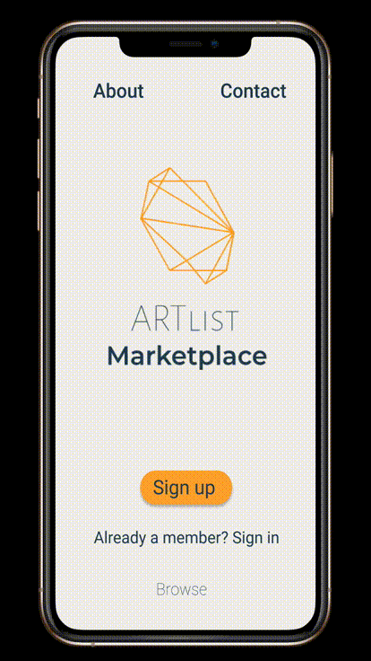

# Artlist
 React on Rails full stack utilizing a RESTful JSON API. 

# PROJECT 4 README <!-- omit in toc -->

> The Project Planning section **should be completed** for your project pitch with instructors.
>
> To ensure correct Markdown, I recommend cloning this wiki and copy/pasting the raw template code.

- [Overview](#overview)
- [MVP](#mvp)
  - [Goals](#goals)
  - [Libraries](#libraries)
  - [Client (Front End)](#client-front-end)
    - [Wireframes](#wireframes)
    - [Component Tree](#component-tree)
    - [Component Hierarchy](#component-hierarchy)
    - [Component Breakdown](#component-breakdown)
    - [Component Estimates](#component-estimates)
  - [Server (Back End)](#server-back-end)
    - [ERD Model](#erd-model)
- [Post-MVP](#post-mvp)
- [Code Showcase](#code-showcase)
- [Code Issues & Resolutions](#code-issues--resolutions)

<br>

## Overview

_**Artlist** is an online platform that allows striving artists to showcase and sell their original pieces in their own terms._


<br>

## MVP

_**Artlist** MVP_
- _Users can sign up and log in_
- _Users can browse products without logging in_
- _Products can be filtered by category_
- _Logged in users can add new products for sale_
- _Logged in users can edit and delete their own products_
- _Logged in users can see a list of their own products_
- _Users can email the artist directly if interested in purchasing the product_


<br>

### Goals

- _Implement all MVP features_
- _The app should be resposive for mobile, tablet and desktop_
- _Adhere to maintainable and scalable software development practices_


<br>

### Libraries

> Use this section to list all supporting libraries and dependencies, and their role in the project.

|     Library      | Description                                |
| :--------------: | :----------------------------------------- |
|      React       | _Used to build the application front-end._ |
|   React Router   | _Used to manage component routes._         |
| Ruby on Rails    | _Used to create the JSON API back-end._    |


<br>

### Client (Front End)

#### Wireframes

- Mobile prototype: https://bit.ly/3gZ5Nm5



- Desktop prototype: https://bit.ly/2UdemQD


- Tablet prototype: https://bit.ly/3dDUj5C


#### Component Tree


#### Component Hierarchy
 
``` structure

src
|__ assets/
      |__ icons
      |__ logo
      |__ mockups
|__ components/
      |__ Layout.js
      |__ Welcome.js
      |__ SignUp.js
      |__ LogIn.js
      |__ Home.js
      |__ Shared.js
              |__Product.js
              |__Category.js
      |__ Details.js
      |__ Artist.js
      |__ Create.js
      |__ Update.js
|__ services/
      |__ user.js
      |__ product.js

```

#### Component Breakdown

> Use this section to go into further depth regarding your components, including breaking down the components as stateless or stateful, and considering the passing of data between those components.

|  Component   |    Type    | state | props | Description                                                      |
| :----------: | :--------: | :---: | :---: | :--------------------------------------------------------------- |
|    Layout    | class      |   y   |   y   | _Contains all shared UI across all components._               |
|  Welcome     | functional |   n   |   n   | _The Welcome Page is the entry point with links for Sign Up, Log In, browse, and logo._ |
|   Sign Up    |   class    |   n   |   n   | _Contains a form that allows the user to create an account._      |
| Log In       | functional |   n   |   n   | _Contains a form that allows the user to log in._                 |
|    Home      | functional |   y   |   n   | _Displays a list of categories and products._ |
|    Details   | functional |   n   |   y   | _Provides all products information and link to artist’s page. Also provides a link to email the artist in case the user in interested in purchasing the piece._               |
|  Artist      | functional |   y   |   y   | _Displays all products posted by a specific artist._       |
|   Create     |   class    |   n   |   n   | _contains a form that allows user to post item for sale._      |
| Update       | functional |   y   |   y   | _Displays all products that belongs to the user with edit and delete capability._|
|  Product      | functional |   y   |   y   | _Displays product information._       |
|  Category      | functional |   y   |   y   | _Displays the categories that can be used as a filter._       |


#### Component Estimates

> Use this section to estimate the time necessary to build out each of the components you've described above.

| Task                | Priority | Estimated Time | Time Invested | Actual Time |
| ------------------- | :------: | :------------: | :-----------: | :---------: |
| Layout              |    L     |     3 hrs      |     2 hrs     |    3 hrs    |
| Welcome             |    H     |     3 hrs      |     1 hrs     |     TBD     |
| Sign Up             |    H     |     3 hrs      |     1 hrs     |     TBD     |
| Log In              |    H     |     3 hrs      |     1 hrs     |     TBD     |
| Home                |    H     |     3 hrs      |     1 hrs     |     TBD     |
| Details             |    H     |     3 hrs      |     1 hrs     |     TBD     |
| Product             |    H     |     3 hrs      |     1 hrs     |     TBD     |
| Category            |    H     |     3 hrs      |     1 hrs     |     TBD     |
| Create              |    H     |     3 hrs      |     1 hrs     |     TBD     |
| Update              |    H     |     3 hrs      |     1 hrs     |     TBD     |
| TOTAL               |          |     6 hrs      |     3 hrs     |     TBD     |


<br>

### Server (Back End)

#### ERD Model

> Use this section to display an image of a computer generated ERD model.

<br>

***

## Post-MVP

> Use this section to document ideas you've had that would be fun (or necessary) for your Post-MVP. This will be helpful when you return to your project after graduation!

***

## Code Showcase

> Use this section to include a brief code snippet of functionality that you are proud of and a brief description.

## Code Issues & Resolutions

> Use this section to list of all major issues encountered and their resolution, if you'd like.
